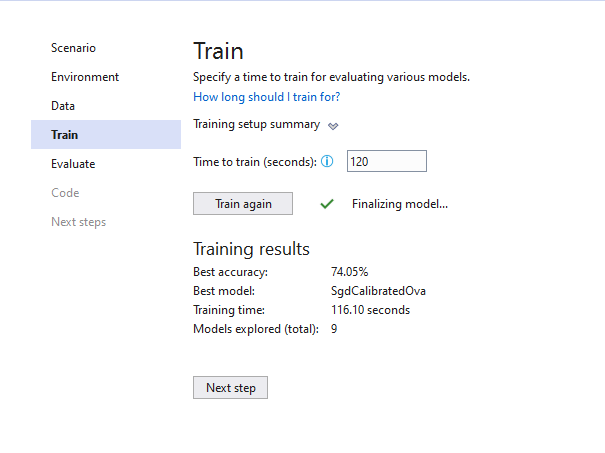

# MyFirstMLApp
This is my first Machine Learning applicationusing ML.NET Model Builder in Visual Studio

## Result

| # | Trainer | MicroAccuracy | MacroAccuracy | Duration | #Iteration |
| --- | --- | --- | --- | --- | --- |
| 1 | AveragedPerceptronOva | 0.7086 | 0.6750 | 7.8 | 1 |
| 2 | SdcaMaximumEntropyMulti | 0.6859 | 0.6682 | 14.1 | 2 |
| 3 | LightGbmMulti | 0.6818 | 0.6391 | 10.4 | 3 |
| 4 | SymbolicSgdLogisticRegressionOva | 0.6408 | 0.6158 | 5.5 | 4 |
| 5 | FastTreeOva | 0.6962 | 0.6632 | 33.4 | 5 |
| 6 | LinearSvmOva | 0.7135 | 0.6774 | 5.0 | 6 |
| 7 | LbfgsLogisticRegressionOva | 0.7301 | 0.6946 | 10.5 | 7 |
| 8 | SgdCalibratedOva | 0.7405 | 0.6846 | 6.9 | 8 |
| 9 | FastForestOva | 0.7102 | 0.6839 | 22.5 | 9 |

### Experiment Results

| Summary|
| --- |
|ML Task: multiclass-classification|
|Dataset: D:\GitHub\MyFirstMLApp\wikipedia-detox-250-line-data.tsv |
|Label : Sentiment |
|Total experiment time : 116.0968219 Secs|
|Total number of models explored: 9|

### Top 5 models explored 

| # | Trainer | MicroAccuracy | MacroAccuracy | Duration | #Iteration |
| --- | --- | --- | --- | --- | --- |
| 1 | SgdCalibratedOva | 0.7405 | 0.6846 | 6.9 | 1 |
| 2 | LbfgsLogisticRegressionOva | 0.7301 | 0.6946 | 10.5 | 2 |
| 3 | LinearSvmOva | 0.7135 | 0.6774 | 5.0 | 3 |
| 4 | FastForestOva | 0.7102 | 0.6839 | 22.5 | 4 |
| 5 | AveragedPerceptronOva | 0.7086 | 0.6750 | 7.8 | 5 |

